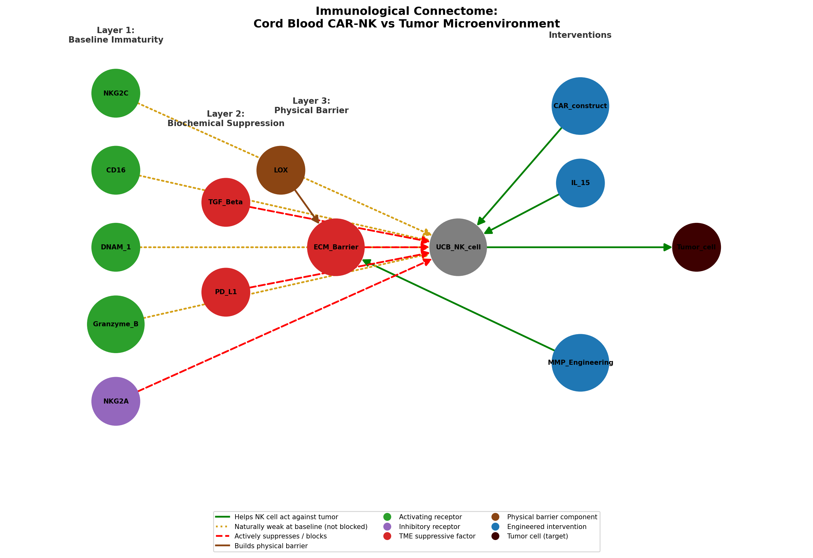

# Cord Blood CAR-NK Cells and the Tumor Microenvironment: An Immunological Connectome

**The question I wanted to answer:** cord blood-derived CAR-NK cells are a promising cancer therapy — easy to source, low risk of complications — and they work well against blood cancers. So why do they struggle so much against solid tumors like breast cancer? And what does current research suggest could fix that?

**What this actually is:** I read through several papers on this topic and mapped what I learned as a network diagram — a "connectome," borrowing a concept from neuroscience (explained below). It's not new research. It's me organizing existing science into something I could actually understand and explain, instead of just skimming abstracts.

**What's from the papers vs. what's mine:** every biological fact in here — the receptor numbers, the mechanisms, the specific finding that these problems feed into each other — comes from the five sources listed in [`references.md`](./references.md). What's mine is deciding to use the connectome structure, picking which papers to connect, and building the three-layer argument out of them.

**Being upfront about AI:** I'm not a coder. I used AI to help write the Python/matplotlib code that draws this diagram, and to help me fact-check my citations against the actual papers (which caught a real mistake — see the note at the bottom of `references.md`). The research, the argument, and the choices about what to include are mine.

## Why I used a "connectome" structure

Neuroscientists map the fruit fly brain as a network of neurons and the connections between them, to see where signals travel fine and where they break down. I borrowed that idea for this project — except instead of neurons, the nodes here are NK cell receptors and tumor microenvironment factors, and the edges show how they help or block a cord blood-derived CAR-NK cell trying to fight a solid tumor.

## Background

Cord blood is a good source for NK cell therapy — it's available off-the-shelf, low risk of graft-versus-host disease, no need for a strict donor match. Add a CAR (chimeric antigen receptor) and the cell can target a specific tumor protein directly.

But cord blood NK cells start at a disadvantage: they're developmentally immature. Compared to adult NK cells, they have lower levels of activating receptors and cytotoxic molecules (CD16, DNAM-1, NKG2C, granzyme B, perforin), and higher levels of the inhibitory receptor NKG2A (Sarvaria et al., 2017). So even before the cell reaches a tumor, it's already starting out weaker.

## The three layers that stack up against it

This is the core argument: it's not one problem, it's three, and they make each other worse.

**Layer 1 — the cell starts weak.** Low activating signals, high inhibitory signal, before it even meets a tumor (Sarvaria et al., 2017).

**Layer 2 — the tumor suppresses it chemically.** TGF-β and PD-L1 both directly suppress NK cell function (Viel et al., 2016; Hsu et al., 2018), and this is a recognized issue for CAR-NK persistence specifically (Lee et al., 2025).

**Layer 3 — the tumor physically blocks it, and that's connected to Layer 2.** Breast tumors build a stiff wall of collagen (the extracellular matrix, or ECM), cross-linked by enzymes from cancer-associated fibroblasts (CAFs). A 2026 review (Wu et al.) shows this isn't just a passive wall — stiffness directly interferes with how NK cells kill (CD44-based anchoring, a shift away from killing toward just secreting cytokines, a thickened glycocalyx in one breast cancer model), and separately makes tumor cells pump out more PD-L1. So the physical barrier and the chemical suppression aren't separate problems — they reinforce each other.

Worth being honest here: most of the NK-specific evidence for Layer 3 comes from other tumor types, not breast cancer specifically, and not from cord blood CAR-NK cells specifically. I'm extrapolating. More on that in Limitations below.

## The diagram

How to read it:
- Receptors and cytotoxic molecules sit inside the NK cell circle, because that's literally where they are. Amber ring = under-expressed in cord blood NK vs. adult NK; red ring = over-expressed (NKG2A).
- Green = helps the NK cell. Red dashed = suppresses or blocks it. Brown = builds/stiffens the barrier (dashed brown = the feedback loop, stiffness activating CAFs). Magenta dash-dot = upregulates something elsewhere (PD-L1 in tumor cells, not a direct hit on the NK cell). Blue = an engineered or drug intervention.
- Each intervention points at the layer it's meant to fix. Layer 2 doesn't have one, because none of my sources covered one — that's a real gap, not something I forgot to draw.
- I didn't draw an ECM → TGF-β arrow, because I could only find that link supported in other tumor types, not this one.
- Simplified on purpose: NKG2A actually works through a partner molecule called HLA-E, and PD-L1 through PD-1 on the NK cell — I drew these as direct arrows for clarity instead of adding every intermediate step.
- Nothing here is a made-up number. Every connection is a qualitative, cited relationship. Run `immune_connectome.py` yourself and it prints a table showing exactly which paper backs which arrow.

## What might actually help, based on what I read

**Biological:**
- IL-15 priming restores NK cytotoxicity back toward adult NK levels (Sarvaria et al., 2017).
- IL-15 armoring — engineering the cell to make its own IL-15 so it doesn't need an outside supply — helps it survive longer (Lee et al., 2025).
- The CAR itself works around the cell's weak natural receptors by giving it a new, targeted way to recognize the tumor (Lee et al., 2025).
- ECM-degrading enzymes — hyaluronidase specifically improved how well NK-92 cells got into a pancreatic tumor in one study (Wu et al., 2026).
- LOX/LOXL2 inhibition helped T cells migrate better and respond better to checkpoint blockade — I'm extrapolating that this could help NK cells too, since the paper itself doesn't test that directly. Worth noting the same review flags real risks here: degrading the matrix indiscriminately can help tumors spread or cause bleeding, and a drug targeting this pathway (simtuzumab) failed in phase II trials.

**Where I think computation could help, though nobody's proven it in this exact context:**
- Screening cord blood donor units for ones that already have a better starting receptor profile.
- Using computational tools to help design a better CAR construct.

## Limitations — being honest about what this isn't

- I haven't done any lab work. No experiments, no cell culture, nothing. Everything here is from reading.
- Nothing in the diagram is measured data — it's all qualitative relationships pulled from papers.
- Five sources isn't a lot. It's enough to build one defensible argument, not a real literature review. A proper one would need a lot more primary research, especially on NK infiltration specifically.
- A good chunk of the Layer 3 evidence comes from other cancers, and from NK cells in general rather than cord blood CAR-NK cells specifically. Applying it to my exact topic is my own inference, not something the papers proved directly.
- I simplified some mechanisms (NKG2A/HLA-E, PD-L1/PD-1) into direct arrows instead of drawing every receptor-ligand step.

## About this project

I built this on my own time, ahead of applying to the Global Korea Scholarship (GKS-U) for Medicinal Biotechnology at Dong-A University. I emailed Professor Kim Seok-ho's lab with a question about their research, and his reply about what his lab currently focuses on is part of what shaped this project's direction. Two of his lab's papers are part of my reading: the anti-ErbB3 CAR-NK paper (Lee et al., 2025 — directly cited above, and he's the senior/corresponding author, which I confirmed through the journal's own listed contact info, matching the email he actually replied to me from) and a newer paper on nanobody-based CAR-NK cells against pancreatic cancer (Jung et al., 2025), which I read as background since it's outside this project's specific focus on breast cancer.

## What I'm doing next

- Turning this into an actual longer literature review, with more primary sources — especially on NK cell infiltration and ECM-targeted treatments.
- Reading into combination approaches that tackle TME suppression head-on, including some recent CAR-NK + CAR-macrophage work out of Dong-A.
- Adding the CAF feedback loop more clearly to the diagram and drawing in the HLA-E/PD-1 steps I simplified out.
- Eventually, I want to actually learn lab techniques like cell culture and flow cytometry — reading papers can only take this so far.

## Sources

Full citation list in [`references.md`](./references.md).
