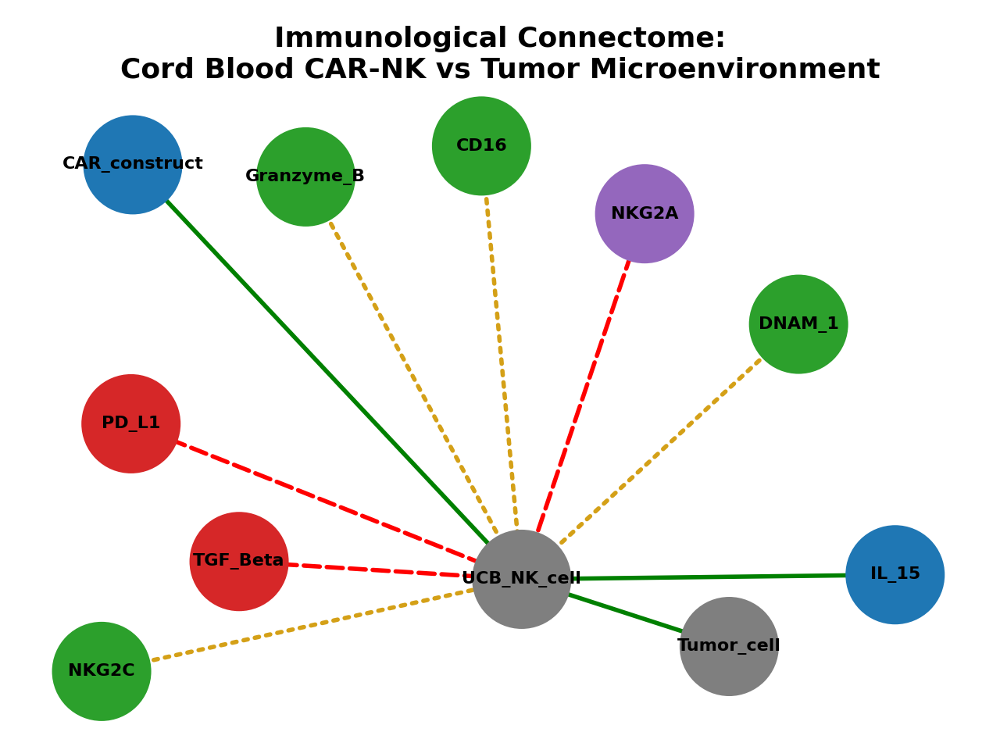

# Cord Blood CAR-NK Cells and the Tumor Microenvironment: An Immunological Connectome

An independent literature review and network-based visualization exploring why cord blood-derived CAR-NK cells struggle against solid tumors like breast cancer, and what current research suggests could help.

## Why this project

In neuroscience, researchers have mapped the fruit fly brain as a "connectome" — a network of neurons (nodes) and synapses (edges) — to see where signals travel well and where they break down. This project borrows that same structural idea and applies it to immunology: instead of neurons and synapses, the nodes here are NK cell receptors and tumor microenvironment (TME) factors, and the edges show how they help or hinder a cord blood-derived CAR-NK cell's ability to fight a solid tumor.

This isn't a claim of new scientific discovery. It's a way of organizing and visualizing existing, cited research to make a compounding problem easier to see clearly.

## Background

Cord blood is an attractive source for NK cell therapy because it's available "off-the-shelf," carries a low risk of graft-versus-host disease, and doesn't require strict donor matching. Engineering these cells with a Chimeric Antigen Receptor (CAR) gives them the ability to target specific tumor proteins directly.

But cord blood-derived NK (UCB-NK) cells come with a built-in disadvantage: they are developmentally immature. Compared to adult peripheral blood NK cells, they show **decreased expression of activating receptors and cytotoxic molecules** (CD16, DNAM-1, NKG2C, granzyme B, perforin), and **higher expression of the inhibitory receptor NKG2A** (Sarvaria et al., 2017, *Frontiers in Immunology*). In plain terms: even before a UCB-NK cell reaches a tumor, its "attack signal" starts out weaker than an adult donor cell's would.

## The compounding bottleneck

This project's central observation, drawn from the cited literature, is that UCB-NK cells face **two layers of disadvantage, not one**:

1. **Baseline immaturity** — weak activating receptor expression and strong inhibitory signaling, present before the cell ever encounters a tumor (Sarvaria et al., 2017).
2. **Tumor microenvironment suppression** — once inside a solid tumor, factors like TGF-beta and PD-L1 further suppress immune cell function, a well-documented mechanism in solid tumor immunotherapy research generally, and specifically discussed as a persistence challenge for CAR-NK cells (Kim et al., 2025, *Cancer Immunology, Immunotherapy*).

These two layers compound each other, which is part of why translating CAR-NK therapy from blood cancers to solid tumors like breast cancer has been difficult.

## The connectome diagram

The diagram above maps this relationship. Colors distinguish three kinds of connection:
- **Green (solid):** helps the CAR-NK cell act against the tumor
- **Amber (dotted):** a receptor that is naturally under-expressed at baseline — weak, but not actively blocked
- **Red (dashed):** something actively suppressing the cell's function

Every edge in this diagram is backed by a citation, listed in full in [`references.md`](./references.md) and printed directly in the code's output. No relationship strength in this diagram is numerically invented — labels are qualitative and traceable to a real source. The code used to generate it is in [`immune_connectome.py`](./immune_connectome.py).

## What current research suggests could help

Drawing on the sources cited throughout this project, two categories of approach are relevant to closing this gap:

**Biological approaches**
- Cytokine priming with IL-15 (alone or with IL-2), shown to restore or enhance UCB-NK cytotoxicity toward peripheral blood NK cell levels (Sarvaria et al., 2017)
- IL-15 armoring — engineering the CAR-NK cell to produce its own IL-15, supporting persistence without relying on external cytokine supply (Kim et al., 2025)
- CAR engineering itself, which gives the cell a targeted recognition mechanism that doesn't depend on its naturally weaker activating receptors (Kim et al., 2025)

**Where computational/AI approaches could plausibly contribute**
- Donor or cell-line screening using existing genomic and flow cytometry data, to identify which cord blood units start with a more favorable receptor profile before expansion
- Computational protein/receptor design tools to help optimize CAR constructs for tumor specificity and reduce reliance on the cell's weaker native signaling
- These are proposed directions based on how computational tools are used elsewhere in immunotherapy research — not claims of a built or tested solution here

## Sources

See [`references.md`](./references.md) for the full citation list.

## About this project

This project was built as part of independent research ahead of applying to the Global Korea Scholarship (GKS-UG), Medicinal Biotechnology, Dong-A University. Correspondence with Professor Kim Seok-ho (Dong-A University, Department of Medicinal Biotechnology), whose lab's published work is cited here, helped shape the direction of this review.

## Next steps

- Complete a full 3-5 page written literature review expanding on the background above
- Continue reading into combination-therapy approaches for overcoming TME immunosuppression
- Learn practical lab methods (cell culture, flow cytometry) relevant to this research area
